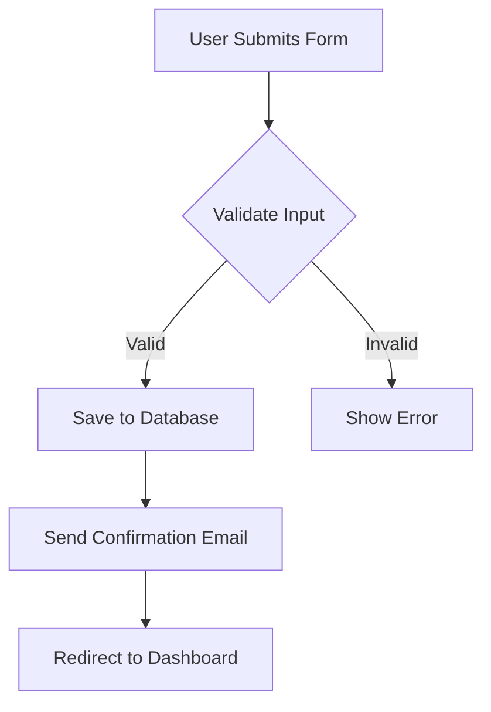

# Feature Documentation

This directory contains detailed feature specifications and documentation for AssetBridge.

## Purpose

Feature documents provide comprehensive specifications for individual features or feature groups. They serve as:

- **Implementation Guides** - Detailed specifications for developers
- **Design Documentation** - UI/UX designs and user workflows
- **Technical Specifications** - API endpoints, data models, algorithms
- **Testing Guidelines** - Test scenarios and edge cases
- **User Documentation** - How features work from user perspective

## Directory Structure

```
docs/features/
├── README.md              # This file
├── TEMPLATE.md            # Feature documentation template
├── settings/              # Settings module features
│   ├── roles-permissions.md
│   ├── departments.md
│   └── users.md
├── vendors/               # Vendor management features
│   ├── registration.md
│   ├── evaluation.md
│   └── profile.md
├── procurement/           # Procurement workflow features
│   ├── purchase-request.md
│   ├── purchase-order.md
│   └── grn.md
└── stock/                 # Stock management features
    ├── inventory.md
    └── tracking.md
```

## Feature Document Template

Each feature document should include:

### 1. Feature Overview
- Feature name and ID
- Module/category
- Priority and status
- Related features

### 2. Business Context
- Why this feature exists
- Problems it solves
- User benefits

### 3. User Stories
- As a [role], I want [goal] so that [benefit]
- Acceptance criteria for each story

### 4. User Interface
- Wireframes/mockups
- User workflows
- Navigation flow
- Error states

### 5. Technical Specification
- Data models and schemas
- API endpoints
- Business logic
- Validation rules

### 6. Implementation Details
- Component structure
- State management
- Dependencies
- Third-party integrations

### 7. Testing Strategy
- Unit test scenarios
- Integration test scenarios
- E2E test scenarios
- Edge cases and error handling

### 8. Security Considerations
- Authentication/authorization
- Data validation
- Input sanitization
- Access control

### 9. Performance Considerations
- Expected load
- Optimization strategies
- Caching requirements
- Database indexes

### 10. Future Enhancements
- Planned improvements
- Feature extensions
- Known limitations

## Feature Status

Track feature implementation status:

| Status | Description | Actions Required |
|--------|-------------|------------------|
| **Planning** | Requirements being defined | SRS documentation, design mockups |
| **Design** | UI/UX design in progress | Wireframes, user flows |
| **In Development** | Code being written | Implementation, unit tests |
| **Testing** | QA and testing phase | Test execution, bug fixes |
| **Review** | Code review and refinement | Address feedback |
| **Deployed** | Live in production | Monitor, gather feedback |
| **Deprecated** | No longer supported | Migration guide |

## Feature Naming Convention

Use clear, descriptive names:

- `feature-name.md` - Lowercase with hyphens
- `module/feature-name.md` - Group by module

Examples:
- `vendors/registration.md`
- `procurement/purchase-order.md`
- `settings/roles-permissions.md`

## Creating New Feature Documents

When documenting a new feature:

1. **Create feature document** in appropriate module folder
   ```bash
   # Create new feature document
   cp docs/features/TEMPLATE.md docs/features/module/feature-name.md
   ```

2. **Fill in all sections** of the template
   - Complete overview and business context
   - Add user stories with acceptance criteria
   - Include UI mockups or wireframes
   - Document technical specifications
   - Define testing strategy

3. **Link to related documents**
   - Reference SRS requirements
   - Link to sprint planning
   - Connect to related features

4. **Update this README** with the new feature

5. **Reference in CLAUDE.md** if it's a major feature

## Integration with Development Workflow

### Linking Features to Code

In code files, reference features:
```typescript
/**
 * Vendor Registration Component
 * Feature: vendors/registration.md
 * Implements: FR-101, FR-102, FR-103
 */
export const VendorRegistration = () => {
  // Implementation
};
```

### Linking Features to Tests

In test files:
```typescript
/**
 * Vendor Registration Tests
 * Feature: vendors/registration.md
 * Tests: FR-101, FR-102, FR-103
 */
describe('Vendor Registration', () => {
  // Tests
});
```

### Linking Features to Sprints

In sprint planning:
```markdown
# Sprint 2

## Features
- vendors/registration.md (P0)
- vendors/profile.md (P1)
```

## Best Practices

### DO ✅

- **Start with User Stories** - Understand the user need first
- **Include Visual Mockups** - Show, don't just tell
- **Document Edge Cases** - Think through error scenarios
- **Link Requirements** - Connect to SRS documents
- **Update Regularly** - Keep documentation current with code
- **Add Examples** - Sample data, API requests/responses
- **Consider Accessibility** - Document keyboard navigation, screen readers

### DON'T ❌

- **Skip Technical Details** - Developers need specifics
- **Forget Security** - Always consider security implications
- **Ignore Performance** - Think about scale and optimization
- **Be Vague** - Clear, specific documentation is crucial
- **Work in Isolation** - Coordinate with related features

## Documentation Standards

### Writing Style

- Use clear, concise language
- Write in present tense
- Use active voice
- Define acronyms on first use

### Code Examples

Always include:
- Language identifier in code blocks
- Comments explaining key parts
- Complete, runnable examples when possible

```typescript
// Good example
export interface Vendor {
  id: string;           // Unique identifier
  name: string;         // Company name
  email: string;        // Contact email
  status: VendorStatus; // Active, Inactive, Pending
}
```

### API Documentation

For each endpoint, document:
- HTTP method and path
- Request headers
- Request body (with example)
- Response codes
- Response body (with example)
- Error scenarios

Example:
```markdown
### POST /api/vendors

Create a new vendor.

**Request:**
```json
{
  "name": "ABC Corporation",
  "email": "contact@abc.com",
  "phone": "+1-555-0123"
}
```

**Response (201):**
```json
{
  "success": true,
  "data": {
    "id": "vendor_123",
    "name": "ABC Corporation",
    "status": "pending"
  }
}
```

**Errors:**
- 400: Invalid input data
- 409: Vendor already exists
```

## Review Checklist

Before marking a feature document as complete:

- [ ] Overview section complete with clear description
- [ ] User stories defined with acceptance criteria
- [ ] UI mockups or wireframes included
- [ ] Technical specification complete
- [ ] API endpoints documented
- [ ] Data models defined
- [ ] Testing strategy outlined
- [ ] Security considerations addressed
- [ ] Performance considerations documented
- [ ] Related documents linked
- [ ] Code examples provided where helpful

## Tools and Resources

### Mockup Tools
- Figma (https://figma.com)
- Excalidraw (https://excalidraw.com) - Quick diagrams
- Mermaid (https://mermaid.js.org) - Diagrams in markdown

### Example Mermaid Diagram



## Related Documentation

- **[docs/srs/](../srs/)** - Software Requirements Specification
- **[docs/sprints/](../sprints/)** - Sprint planning documents
- **[docs/bugs/](../bugs/)** - Bug tracking (may reference features)
- **[docs/guides/](../guides/)** - Development guides
- **[CLAUDE.md](../../CLAUDE.md)** - Architecture overview

## Version History

Track major changes to feature documentation:

- When making significant changes, add a "Version History" section to the feature document
- Note what changed and why
- Include date and author (if applicable for team projects)

Example:
```markdown
## Version History

| Date | Version | Changes | Author |
|------|---------|---------|--------|
| 2024-10-14 | 1.0 | Initial feature specification | Initial Team |
| 2024-10-20 | 1.1 | Added bulk import functionality | Development Team |
```

## Tips for Solo Development

As a solo developer:

1. **Document as you design** - Write feature docs before coding
2. **Use simple mockups** - Don't over-engineer designs
3. **Keep it practical** - Focus on implementation details
4. **Iterate quickly** - Update docs as you learn during development
5. **Future-proof** - Your future self will thank you for good docs

---

**Remember**: Good feature documentation saves time during development, makes onboarding easier (even if it's just future you), and helps maintain code quality.
